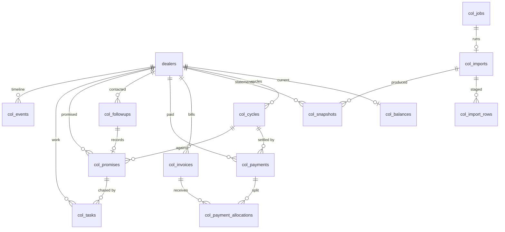

# Database design

MongoDB (Atlas replica set → multi-document transactions available). All new
collections carry the `col_` prefix. Money is whole rupees (Number, integer).
Dates that mean a calendar day are `YYYY-MM-DD` strings (the app's convention);
instants are `Date`. Every document has `createdAt/updatedAt`.

## Additive change to an existing collection

`dealers` gains three optional fields — nothing existing is altered:

| Field | Type | Notes |
|---|---|---|
| `code` | String, sparse unique, uppercase | `SSL14140`; bound from imports or set manually |
| `aliases` | [String] | other party spellings seen for this dealer |
| `phone` | String | for WhatsApp; E.164 |
| `whatsappOptOut` | Boolean | compliance |

## Collections

### col_imports — one per file received (immutable after APPLIED)
`fileName, fileHash (sha256, indexed), fileSize, source (excel|tally|legacy|manual), balanceMode (buckets|snapshot), asOn (YYYY-MM-DD), periods [YYYY-MM], uploadedBy, status (STAGED|VALIDATED|PREVIEWED|APPLYING|APPLIED|FAILED|DUPLICATE|REVERTED), stats {rows, parties, matched, unmapped, errors, new, increased, decreased, cleared, unchanged, reopened, totalBefore, totalAfter}, errorReport [{row, message}], jobId, appliedBy, appliedAt, durationMs, reverted {by, at, reason}, appliedChunks [Number]`
Indexes: `fileHash`, `createdAt:-1`, `status`.

### col_import_rows — staged, validated rows
`importId, rowNo, rawParty, code, matchedDealerId, matchMethod (code|guid|name|alias|manual|none), buckets {YYYY-MM: Number}, total, status (OK|UNMAPPED|ERROR|DUPLICATE), error`
Indexes: `{importId, rowNo}` unique, `{importId, status}`.

### col_snapshots — what a source said about a party at a point in time
`importId, dealerId, asOn, balanceMode, buckets {}, total, prevSnapshotId, prevTotal, delta, classification (NEW|INCREASED|DECREASED|CLEARED|UNCHANGED|REOPENED)`
Indexes: `{dealerId, asOn:-1}`, `{importId, dealerId}` unique.

### col_balances — CURRENT state, one per dealer
`dealerId (unique), salesmanId (denormalised), total, buckets {}, oldestPeriod, ageDays, openCycleId, status (NEW|OPEN|FOLLOW_UP_REQUIRED|PROMISED|PARTIAL_PAYMENT|OVERDUE|HIGH_PRIORITY|CLEARED|CLOSED), priority (LOW|MEDIUM|HIGH|CRITICAL), lastImportId, lastSnapshotAt, lastChangeAt, lastPaymentAt, lastFollowupAt, nextFollowupAt, promise {id, amount, date}, version`
Indexes: `salesmanId`, `status`, `total:-1`, `nextFollowupAt`, `{salesmanId, status}`.

### col_cycles — one open period of indebtedness
`dealerId, cycleNo, status (OPEN|CLEARED|CLOSED_MANUAL), openedAt, openedByImportId, openingTotal, peakTotal, closedAt, closedByImportId, finalTotal, paidTotal (confirmed payments allocated), observedDecreaseTotal, daysOpen`
Indexes: `{dealerId, cycleNo}` unique, `{dealerId, status}`.
Invariant: at most one OPEN cycle per dealer; a CLEARED cycle never changes status again.

### col_events — the timeline (append-only)
`dealerId, cycleId, type, amount, before, after, importId, refType, refId, by, at, note`
Types: `NEW_OUTSTANDING, INCREASED, DECREASED, CLEARED, UNCHANGED, REOPENED, INVOICE_SEEN, INVOICE_SETTLED, PAYMENT_RECORDED, PAYMENT_CONFIRMED, PAYMENT_CANCELLED, ADJUSTMENT, RECONCILIATION_DIFFERENCE, FOLLOWUP, PROMISE_MADE, PROMISE_KEPT, PROMISE_BROKEN, TASK_CREATED, TASK_DONE, WHATSAPP_SENT, WHATSAPP_DELIVERED, MANUAL_EDIT, ASSIGNMENT_CHANGED`
Indexes: `{dealerId, at:-1}`, `{type, at:-1}`, `importId`.

### col_invoices — bill-level pending, where the source provides it
`dealerId, billRef, billDate, dueDate, amount, pending, status (OPEN|SETTLED|WRITTEN_OFF), source, firstSeenImportId, lastSeenImportId, settledAt`
Indexes: `{dealerId, billRef}` unique, `{dealerId, status}`, `dueDate`.

### col_payments
`paymentNo (Counter), dealerId, cycleId, date, amount, mode (CASH|CHEQUE|NEFT|RTGS|UPI|CARD|OTHER), reference, bankReference, collectedBy, enteredBy, remarks, proofId → col_attachments, status (RECORDED|CONFIRMED|BOUNCED|CANCELLED), allocated, unallocated, confirmedBy, confirmedAt, source (manual|migrated)`
Indexes: `{dealerId, date:-1}`, `status`, `paymentNo` unique.

### col_payment_allocations
`paymentId, dealerId, cycleId, invoiceId (nullable), amount, by, at`
Indexes: `paymentId`, `invoiceId`. Invariant: Σ allocations of a payment ≤ payment.amount.

### col_attachments
`kind (payment_proof|other), mime, size, data (Buffer), uploadedBy` — kept out of the payment document so lists stay light.

### col_followups — every interaction, permanent
`dealerId, cycleId, employeeId, date, time, channel (CALL|VISIT|WHATSAPP|EMAIL|SMS|OTHER), discussion, outcome (NO_ANSWER|CALLBACK|PROMISED|DISPUTED|PARTIAL|PAID|NOT_REACHABLE|OTHER), customerResponse, promiseId, nextFollowupDate, nextAction, remarks, createdBy, source (app|migrated), legacyId`
Indexes: `{dealerId, date:-1}`, `{employeeId, date:-1}`, `nextFollowupDate`.

### col_promises
`dealerId, cycleId, employeeId, amount, promiseDate, status (PENDING|PARTIALLY_FULFILLED|FULFILLED|BROKEN|CANCELLED), received, followupId, notes, brokenAt, fulfilledAt, legacyId`
Indexes: `{dealerId, status}`, `{promiseDate, status}`, `{employeeId, status}`.

### col_tasks — collection tasks (distinct from the app's generic `tasks`)
`taskNo (Counter), dealerId, cycleId, employeeId, type (CALL|VISIT|PAYMENT_COLLECTION|WHATSAPP|SEND_STATEMENT|SEND_INVOICE|FOLLOW_UP|ESCALATION|VERIFICATION|PROMISE_FOLLOW_UP|CUSTOM), priority (LOW|MEDIUM|HIGH|URGENT), dueDate, dueTime, status (OPEN|IN_PROGRESS|DONE|CANCELLED|EXPIRED), points, description, comments [{by, at, text}], createdBy, source (manual|automation|promise|import), ruleId, promiseId, completedBy, completedAt`
Indexes: `{employeeId, status, dueDate}`, `{dealerId, status}`, `taskNo` unique.

### col_employee_activity — daily rollup, recomputable from the tables above
`employeeId, date, followups, calls, visits, whatsapps, tasksDone, tasksOverdue, promisesTaken, promisesKept, promisesBroken, collected, points`
Index: `{employeeId, date}` unique.

### col_employee_reviews
`employeeId, period (YYYY-MM), metrics {key: value}, weights {key: pct} (snapshot of settings at review time), score, managerReview {score, notes, by, at}, status (DRAFT|FINAL)`
Index: `{employeeId, period}` unique.

### col_whatsapp_templates / col_whatsapp_messages
Templates: `key, metaName, language, body, variables [String], category, active`.
Messages: `templateKey, dealerId, to, variables {}, status (QUEUED|SENT|DELIVERED|READ|FAILED|OPTED_OUT), providerMessageId, error, events [{status, at}], sentBy, refType, refId`
Indexes: `providerMessageId`, `{dealerId, createdAt:-1}`, `status`.

### col_notifications
`userId, type, title, body, refType, refId, readAt` — index `{userId, readAt, createdAt:-1}`.

### col_jobs
`type, status (QUEUED|RUNNING|DONE|FAILED), payload, progress {done, total, note}, result, error, heartbeatAt, startedAt, finishedAt` — index `{status, createdAt}`.

### col_audit
`entity, entityId, action, before, after, by, byName, at, source (ui|import|automation|tally|migration), importId, ip` — indexes `{entity, entityId, at:-1}`, `{by, at:-1}`, `at:-1`.

### Settings (existing `Setting` model, key `collections.*`)
`collections.taskPoints`, `collections.reviewWeights`, `collections.automationRules`, `collections.agingBuckets`, `collections.priorityThresholds`, `collections.balanceModeDefault`, `collections.workingDays`.

## ERD

## Transactions and idempotency

Apply runs per chunk of 500 dealers inside `session.withTransaction`. Each
chunk writes snapshots, updates balances (with `version` check), opens/closes
cycles and appends events; the import's `appliedChunks` is updated in the same
transaction. Re-running a chunk is a no-op because `col_snapshots` is unique on
`(importId, dealerId)` and cycle/balance updates are computed from the
snapshot, not from an increment. A job that fails between chunks leaves the
import `APPLYING` with the chunks it completed; it is resumed, never
half-applied to current state without record.
